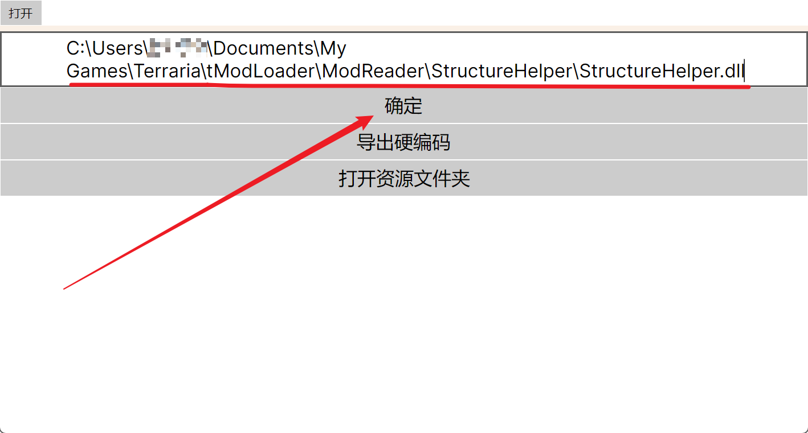
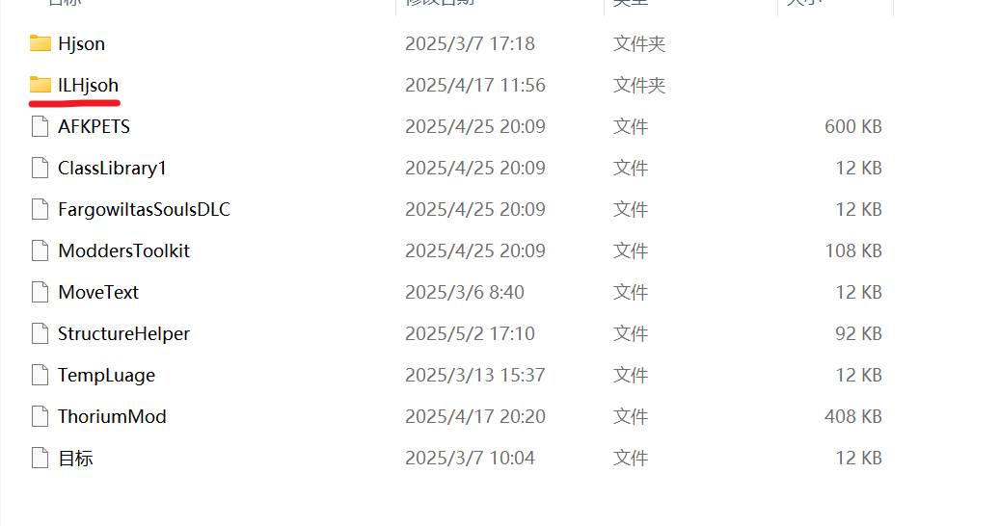
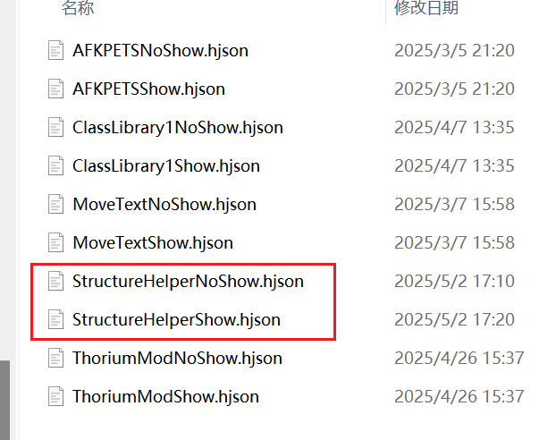
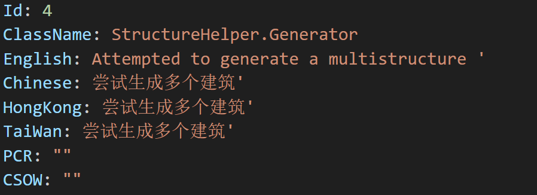
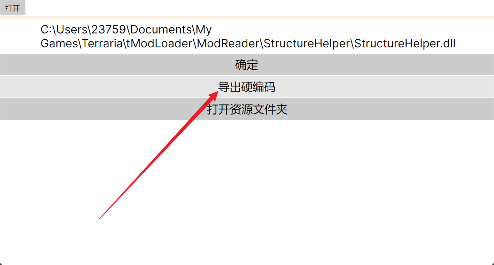
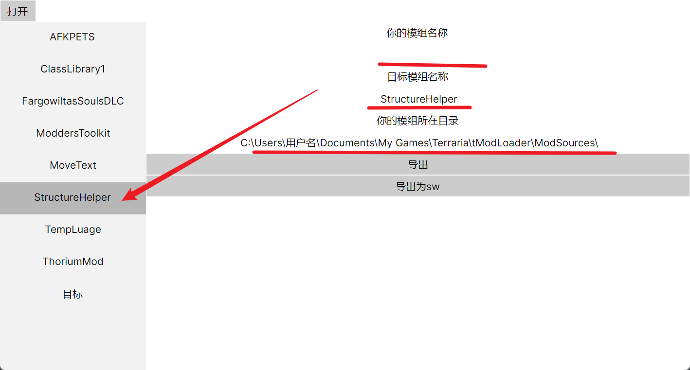
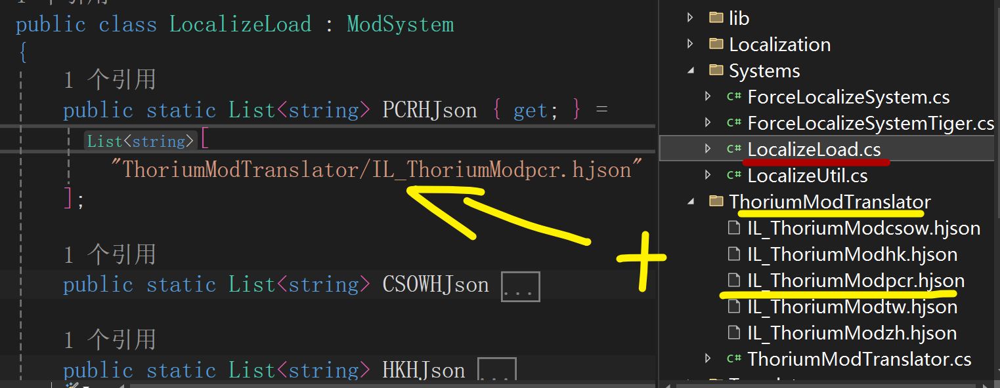

提取，编辑，然后导出

目前已经完成提取编辑导出

- 项目使用[AvaloniaUI](https://github.com/AvaloniaUI/Avalonia)
- 提取部分使用[Mono.Cecil](https://github.com/jbevain/cecil)
- 文件保存使用[SQLite-net](https://github.com/praeclarum/sqlite-net)

(目前已经更改)
- 汉化挂钩使用源码[TerrariaTigerForceLocalizationLib](https://github.com/TigerChenzzz/TerrariaTigerForceLocalizationLib)
  - 文件位于源码目录 : TranslatorFromAssembly/TranslatorFromAssembly/TranslatorLibrary/ForceLocalizeSystem

## 特别鸣谢

- [Tigerzzz](https://github.com/TigerChenzzz)
- [凌](https://github.com/NLick47)
- [虞悖](https://github.com/zlzhaidou)
- 小西王 [月渎](https://github.com/moonditch)
- 反馈 895423665 (企鹅) 答案： 瑟银

## 使用

#### 1. 内容提取

- 打开软件

- 在文本框中输入`dll`的全路径

- 单击提取

  

- 随后单击`打开资源文件夹`，并进入`ILHjson`文件夹

  

- 找到已模组名称开头的`hjson`文件并进行编辑

  

  

- 然后回到软件中，单击`导出硬编码`

  

- 左侧选中要被汉化的模组，并按要求填写后，单击导出

  

- 随后来到模组根目录下的`System`目录下，建议直接使用`VisualStudio`打开模组项目。打开`LocalizeLoad`进行编辑



> 注意System下4个文件的名称空间！

如果只要中文，那么下面的`Load`只留简体中文。上面的集合只填写`ZHHJson`即可。随后编译运行。

```cs
[ModuleInitializer]
public static void LoadLocalizationJson()
{
    Load(PCRHJson, Language.Potralia的害人汉化);
    Load(TWHJson, Language.台湾繁体);
    Load(ZHHJson, Language.简体中文);
    Load(CSOWHJson, Language.文言文汉化);
    Load(HKHJson, Language.香港繁体废除);
}
```

